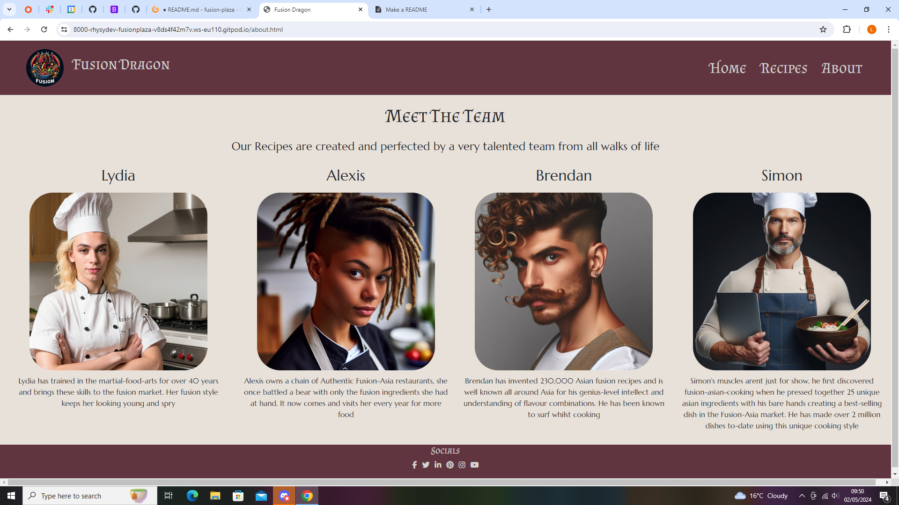
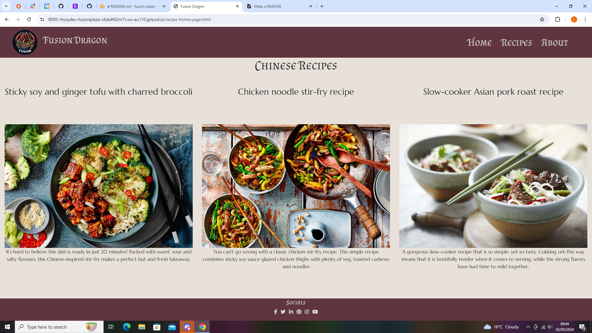
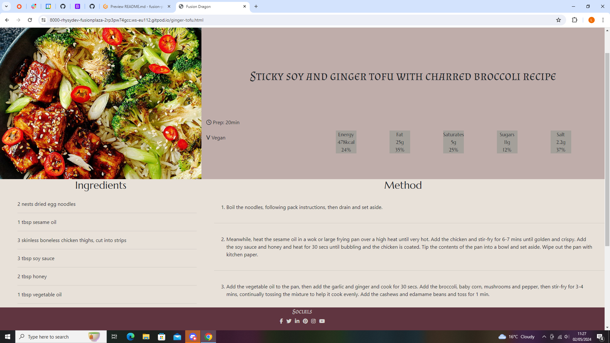
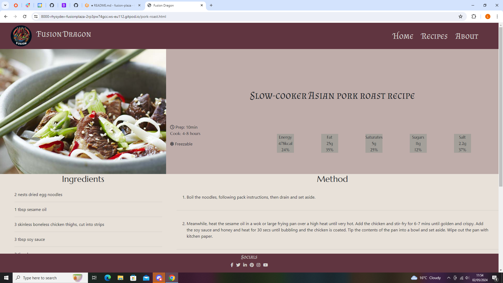

Fusion Dragon Hackathon 1 project - Created by Bootstraps Bootstraps

# Project
Fusion Dragon is a website where a number of recipes can be found to make tasty food from different regions in China, there is also a section about the chef's who have brought these recipes together. We used HTML, CSS, Bootstrap and Flexbox to create our website. 

# Features
- Home Page
- About page
- Recipe hub
- Three recipe pages

- The about me page, giving a breif description of each of the chef's backgrounds.

- The hub page of the recipes avaliable on our website.

- One of the recipe pages avalaible on our website.

- One of the recipe pages avalailbe on our website.

- One of the recipe pages avalailbe on our website.

- A view of the recipe hub page on mobile view.

- A view of the about page on mobile view

# Issues: 
- Cannot get rid of the blue border on the navbar dropdown icon when it is clicked
cannot cause the fusion dragon logo and name to shrink. this causes the navbar to break when below 445px
menu button doesnt change border back to original until clicked off of on mobile version

- Used an old version of bootstrap initially (ver4.1), this led to several issues in regards to making the 
new Bootstrap code work within our website.

- The team had some early issues with getting Gitpod to properly merge our work together on Github which caused some 
loss of code.

- Flexbox proved to be very tempremental when it came to the design of the website, a greater emphisis on using rows and columns 
rather than flexbox will be useful in future.

- The footer would often jump up and cover up words and images before we managed to fix it in place.

- We started working on the website without fully considering the mobile first development stratagy.

- Some overlap of text and header/footer

- Social links not working as there is no dedicated pages to link them to.

- Forgot to ensure some images had a - between each word. This was corrected at the last minute.

# Roadmap

- Add more recipes to the website.

- Have reviews of our recipes, so people can rate them.

- Make a carousel of featured recipes that changes every month.

- Have a link to well known suppliers of authentic ingrediats that can be used to make our dishes.

- Make a more intricate Home page

# Collaberators

- Team Leader Rhys
- Brendan 
- Simon
- Lydia

# Validation

# Fonts
Fonts from Googlefonts

# Icons
From font awesome

# Images

- Chef images are ai-generated from microsofts co-pilot image generator

- Food images taken from Tesco and Google

